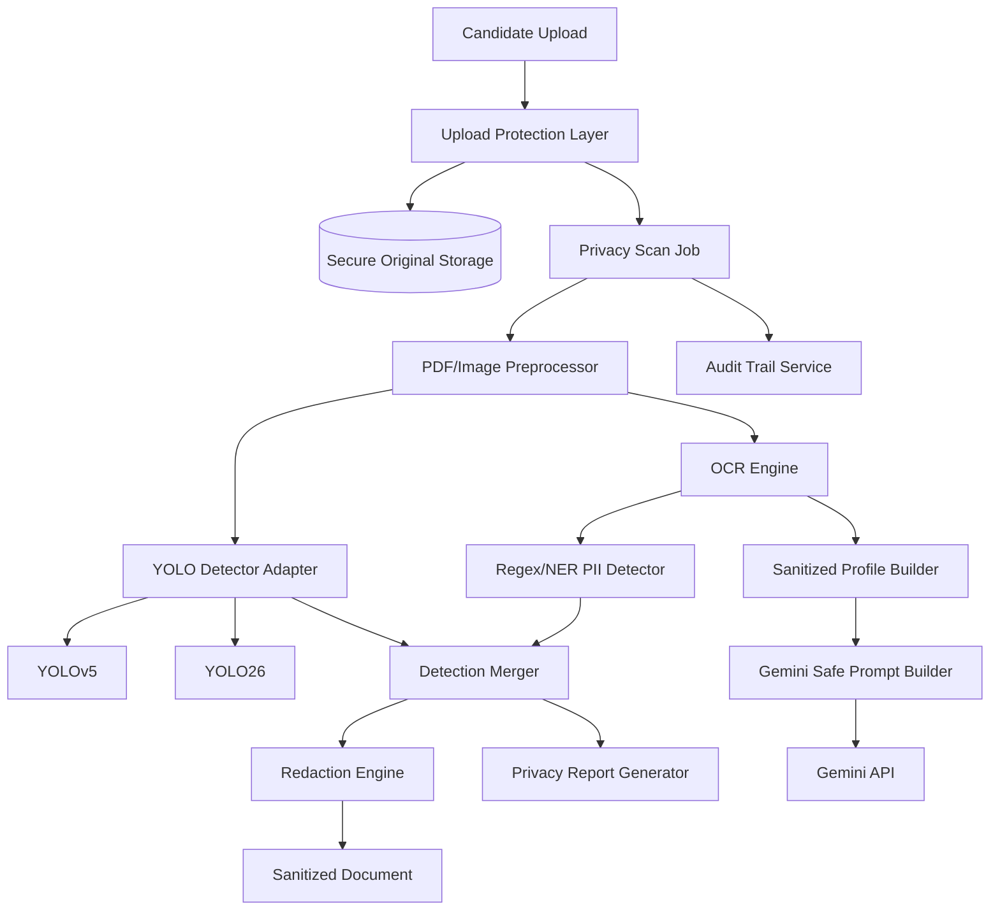

# Applicant Privacy Shield

Judul penelitian:

**Perbandingan YOLOv5 dan YOLO26 pada Sistem Deteksi dan Redaksi Data Visual Sensitif Pelamar Sebelum Pemrosesan AI Screening pada Applicant Tracking System Karierly**

Applicant Privacy Shield adalah prototype penelitian mandiri untuk menjadi privacy gateway sebelum modul AI Screening pada Applicant Tracking System Karierly. Sistem ini dirancang agar CV atau dokumen pendukung pelamar tidak langsung dikirim ke Gemini API dalam bentuk mentah.

Pipeline sistem melakukan validasi dokumen, konversi PDF ke gambar, deteksi area visual sensitif menggunakan YOLOv5 dan YOLO26, OCR, deteksi PII berbasis regex/NER, redaksi otomatis, pembuatan sanitized candidate profile, pembuatan safe prompt, serta pelaporan risiko privasi.

## Status Proyek

Tahap saat ini: **privacy pipeline dan aplikasi Streamlit lokal**.

Dataset final hanya memuat kelas visual yang benar-benar tersedia dan tervalidasi. Pipeline aplikasi tetap merupakan desain prototype; hasil training tidak boleh dianggap sebagai sistem produksi tanpa evaluasi redaksi end-to-end.

## Tujuan Utama

1. Mendeteksi area visual sensitif pada CV atau dokumen pendukung pelamar.
2. Membandingkan performa YOLOv5 dan YOLO26 untuk deteksi area visual sensitif.
3. Melakukan redaksi otomatis pada data visual dan tekstual sensitif.
4. Menghasilkan sanitized document dan sanitized candidate profile.
5. Memastikan Gemini API hanya menerima data yang relevan untuk screening pekerjaan.
6. Menyediakan Privacy Risk Report, Redaction Report, audit trail, dan metrik evaluasi.

## Prinsip Desain

1. **No raw CV to Gemini**: file asli tidak boleh dikirim ke Gemini.
2. **YOLO only detects visual regions**: YOLO tidak dipakai untuk membaca isi CV.
3. **Hybrid privacy detection**: deteksi visual memakai YOLO, deteksi teks memakai OCR + regex/NER.
4. **Privacy-first redaction**: false negative pada data sensitif lebih berbahaya daripada false positive.
5. **Reproducible experiment**: dataset, split, seed, versi model, dan metrik harus terdokumentasi.
6. **Prototype-first**: sistem realistis untuk skripsi dan dapat dijalankan lokal.

## MVP Scope

Fitur wajib MVP:

1. Upload CV atau dokumen pendukung.
2. Validasi tipe file, ukuran file, dan jumlah halaman.
3. Konversi PDF menjadi gambar per halaman.
4. Deteksi visual sensitif memakai YOLOv5 dan YOLO26 melalui adapter yang sama.
5. OCR dokumen.
6. Deteksi PII tekstual dengan regex/NER.
7. Penggabungan hasil deteksi visual dan tekstual.
8. Redaksi area sensitif.
9. Pembuatan sanitized document.
10. Pembuatan sanitized candidate profile.
11. Safe prompt builder untuk Gemini.
12. Privacy Risk Report dan Redaction Report.
13. Audit trail tanpa menyimpan PII mentah di log.
14. Evaluasi kuantitatif YOLOv5 vs YOLO26.

Fitur opsional:

1. Blind screening nama kandidat.
2. Manual review queue untuk dokumen risiko tinggi.
3. Role-based masking lanjutan.
4. Dashboard metrik eksperimen.
5. Active learning untuk memperbaiki anotasi.

## Kelas Deteksi Visual yang Didukung Dataset

Model YOLO pada eksperimen ini hanya dilatih untuk lima kelas berikut:

1. `face_photo`
2. `signature`
3. `qr_code`
4. `barcode`
5. `id_card`

Alamat, kontak, nomor dokumen, stempel, dan kategori PII visual lain tidak diklaim sebagai keluaran YOLO pada versi dataset ini. Perlindungannya tetap melalui OCR, regex/NER, dan manual review untuk kasus berisiko tinggi.

## Kelas Deteksi Tekstual

Kelas utama:

1. `candidate_name`
2. `email`
3. `phone_number`
4. `full_address`
5. `nik`
6. `npwp`
7. `birth_date`
8. `bank_account_number`
9. `certificate_number`
10. `irrelevant_personal_link`
11. `marital_status`
12. `religion`
13. `gender`
14. `family_data`

## Arsitektur Ringkas



## Struktur Dokumentasi

| Dokumen | Isi |
|---|---|
| [Project Overview](docs/00-project-overview.md) | Ringkasan sistem, ruang lingkup, aktor, dan batasan |
| [PRD](docs/01-prd.md) | Product Requirement Document untuk prototype penelitian |
| [SRS dan Arsitektur](docs/02-srs-architecture.md) | Software Requirement Specification, diagram, dan desain modul |
| [API Contract](docs/03-api-contract.md) | Endpoint, payload request, response, dan error format |
| [Database Design](docs/04-database-design.md) | Rancangan tabel PostgreSQL dan relasi |
| [Experiment Plan](docs/05-experiment-plan.md) | Desain eksperimen YOLOv5 vs YOLO26 |
| [Dataset Plan](docs/06-dataset-plan.md) | Rencana dataset open source, anotasi, dan batasan etis |
| [Risk Mitigation](docs/07-risk-mitigation.md) | Risiko teknis, privasi, penelitian, dan mitigasi |
| [Acceptance Criteria](docs/08-acceptance-criteria.md) | Kriteria penerimaan per modul |
| [Dataset Strategy and Preparation](docs/09-dataset-strategy.md) | Strategi dataset, labeling, split, augmentasi, dan script preparation |
| [Manual Dataset Installation](docs/10-manual-dataset-installation.md) | Panduan instalasi manual WIDER FACE, MIDV-500, DocLayNet, FUNSD, dan dataset CV |
| [Dataset Inventory](docs/11-dataset-inventory.md) | Kelas yang tersedia, sumber data, dan batasan eksperimen saat ini |
| [Training YOLOv5 and YOLO26](docs/12-training-yolov5-yolo26.md) | Setup, training, evaluasi, benchmark, export, dan tabel hasil |
| [Redaction Privacy Pipeline](docs/13-redaction-privacy-pipeline.md) | Pipeline lokal, kontrak JSON, aturan redaksi, dan test |
| [Streamlit Application](docs/14-streamlit-application.md) | Instalasi, menjalankan aplikasi, output, dan panel evaluasi |

## Stack Prototype yang Disarankan

| Layer | Teknologi |
|---|---|
| Backend API | Go Echo atau Python FastAPI untuk prototype cepat |
| Worker | Python worker dengan Redis queue |
| Database | PostgreSQL |
| Queue | Redis |
| Object storage lokal | filesystem terstruktur atau MinIO lokal |
| CV model | YOLOv5 dan YOLO26 |
| OCR | Tesseract, PaddleOCR, atau EasyOCR |
| PII text detection | regex, Presidio, spaCy/Stanza/custom NER |
| Redaction | OpenCV, PyMuPDF, Pillow |
| Frontend dashboard | ReactJS |
| AI provider | Gemini API, hanya dengan sanitized candidate profile |

## Dataset Policy

Dataset yang digunakan harus open source, mudah diakses, gratis, dan tidak dikumpulkan sendiri dari data pribadi nyata. Karena penelitian ini menyentuh CV dan PII, setiap dataset wajib diperiksa lisensi dan risiko privasinya sebelum dipakai.

Kandidat awal dataset:

1. Resume/CV dataset dari Kaggle atau Hugging Face untuk dokumen resume.
2. FUNSD untuk OCR, layout, dan form understanding.
3. RVL-CDIP untuk variasi dokumen image berskala besar.
4. Dataset QR/barcode/signature/face open source hanya jika lisensinya sesuai.

Detail ada di [Dataset Plan](docs/06-dataset-plan.md).

Dataset final untuk training YOLO berada di:

```text
datasets/privacy_shield
```

Konfigurasi YOLO:

```text
datasets/privacy_shield/data.yaml
```

## Output Utama Sistem

1. `sanitized_document`: dokumen hasil redaksi permanen.
2. `sanitized_candidate_profile`: JSON berisi skill, pengalaman, pendidikan, proyek, sertifikasi, dan ringkasan non-sensitif.
3. `privacy_risk_report`: laporan jenis data sensitif, severity, confidence, dan status redaksi.
4. `redaction_report`: laporan lokasi redaksi, metode redaksi, dan model/alat pendeteksi.
5. `model_evaluation_report`: perbandingan YOLOv5 dan YOLO26.
6. `privacy_protection_metrics`: metrik keberhasilan perlindungan data.

## Menjalankan Aplikasi

Setelah weight `best.pt` tersedia dan Tesseract sudah terpasang:

```powershell
pip install -r requirements-privacy.txt
streamlit run streamlit_app.py
```

Aplikasi dapat diakses pada `http://localhost:8501`. Pilih backend model, masukkan path weight, unggah dokumen, lalu jalankan redaksi. Detail output dan batasan ada di [Streamlit Application](docs/14-streamlit-application.md).

## Catatan YOLO26

YOLO26 sudah memiliki dokumentasi publik dari Ultralytics. Namun implementasi tetap harus diverifikasi saat tahap coding dengan package dan model weight yang tersedia di environment. Jika YOLO26 tidak dapat dijalankan secara lokal, adapter tetap disiapkan dan status eksperimen dicatat sebagai backend unavailable, bukan diganti dengan implementasi palsu.

## Referensi Awal

1. Ultralytics YOLO26 Documentation: <https://docs.ultralytics.com/models/yolo26>
2. Ultralytics Object Detection Task: <https://docs.ultralytics.com/tasks/detect>
3. Microsoft Presidio Image Redactor: <https://microsoft.github.io/presidio/image-redactor/>
4. FUNSD Dataset: <https://guillaumejaume.github.io/FUNSD/>
5. RVL-CDIP Dataset: <https://adamharley.com/rvl-cdip/>
6. Hugging Face Resume Dataset Example: <https://huggingface.co/datasets/opensporks/resumes>
