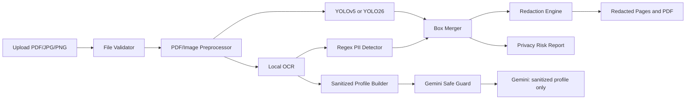

# Applicant Privacy Shield

## 1. Ringkasan

Prototype penelitian untuk Karierly Applicant Tracking System:

> Perbandingan YOLOv5 dan YOLO26 pada Sistem Deteksi dan Redaksi Data Visual Sensitif Pelamar Sebelum Pemrosesan AI Screening pada Applicant Tracking System Karierly.

Sistem adalah privacy gateway sebelum AI Screening. Dokumen pelamar diproses secara lokal untuk mendeteksi dan meredaksi data visual maupun tekstual sensitif. Gemini hanya boleh menerima `sanitized_candidate_profile`, tidak pernah file CV mentah, halaman PDF mentah, OCR text mentah, foto, atau PII.

## 2. Ruang Lingkup Aktual

### Kelas Visual yang Dilatih

Dataset saat ini hanya mendukung lima kelas YOLO berikut:

| ID | Kelas | Kebijakan redaksi |
| ---: | --- | --- |
| 0 | `face_photo` | blur |
| 1 | `signature` | black box |
| 2 | `qr_code` | pixelate |
| 3 | `barcode` | pixelate |
| 4 | `id_card` | black box |

`stamp_or_seal`, `document_number_area`, `contact_block_visual`, `address_block_visual`, dan `sensitive_visual_region` tidak diklaim sebagai keluaran YOLO karena belum ada ground truth yang cukup. Email, telepon, alamat, dan nomor dokumen ditangani lokal dengan OCR + regex; kasus ambigu harus masuk manual review.

### Prinsip Privasi

1. YOLO hanya mendeteksi region visual, bukan membaca isi CV.
2. OCR/regex berjalan lokal.
3. PDF hasil redaksi dibangun ulang dari gambar halaman tersensor sehingga text layer asli tidak tersisa.
4. Output JSON tidak menyimpan nilai PII atau raw OCR text, hanya kategori, bounding box, confidence, dan hash bukti.
5. Artefak dataset, model, eksperimen, dan scan output diabaikan Git.

## 3. Arsitektur



## 4. Dataset dan Split

Dataset final berada di `datasets/privacy_shield` dengan format YOLO standar dan konfigurasi `datasets/privacy_shield/data.yaml`. Semua model membaca folder dan split yang sama.

| Kelas | Sumber | Train | Validation | Test |
| --- | --- | ---: | ---: | ---: |
| face_photo | WIDER FACE | 159393 bbox | 35491 bbox | 4206 bbox |
| signature | Signature corpus | 1920 bbox | 384 bbox | 336 bbox |
| qr_code | QR YOLO corpus | 152 bbox | 29 bbox | 26 bbox |
| barcode | Barcode COCO corpus | 28726 bbox | 6122 bbox | 6093 bbox |
| id_card | MIDV-500 subset | 952 bbox | 312 bbox | 306 bbox |

Raw dataset tidak ada di Git. `datasets/instalasi_manual/archive (2)/data` hanya menyimpan PDF resume open-source untuk eksperimen OCR di masa depan; jangan kirim corpus itu ke Gemini.

Validasi dataset:

```powershell
python scripts/dataset/validate_yolo_labels.py `
  --dataset datasets/privacy_shield `
  --output reports/dataset/validation_summary.json
```

## 5. Instalasi

Gunakan Python 3.10+ dan buat virtual environment:

```powershell
python -m venv .venv
.\.venv\Scripts\Activate.ps1
python -m pip install --upgrade pip
pip install -r requirements-privacy.txt
pip install -r requirements-training.txt
```

Untuk PDF, `PyMuPDF` sudah dicantumkan pada requirements. Untuk OCR, instal Tesseract binary secara terpisah dan pastikan tersedia pada `PATH`:

```powershell
winget install --id UB-Mannheim.TesseractOCR --exact --silent `
  --accept-package-agreements --accept-source-agreements
tesseract --version
```

Untuk YOLOv5, clone repository resmi sekali:

```powershell
git clone https://github.com/ultralytics/yolov5.git external/yolov5
pip install -r external/yolov5/requirements.txt
```

## 6. Training dan Evaluasi

Konfigurasi perbandingan ada pada `configs/training/privacy_shield.yaml`:

- input size: 640
- epochs: 50
- batch size: 8
- seed: 42
- optimizer: SGD
- dataset dan split identik

Gunakan pasangan ukuran model setara, misalnya `yolov5n` versus `yolo26n`.

```powershell
# Training
python scripts/experiment/train_yolov5.py --model-size n --device 0
python scripts/experiment/train_yolo26.py --model-size n --device 0

# Evaluasi test split
python scripts/experiment/evaluate_models.py `
  --backend yolov5 `
  --weights experiments/runs/yolov5/yolov5n_seed42/weights/best.pt `
  --device 0

python scripts/experiment/evaluate_models.py `
  --backend yolo26 `
  --weights experiments/runs/yolo26/yolo26n_seed42/weights/best.pt `
  --device 0

# Benchmark dan laporan perbandingan
python scripts/experiment/benchmark_inference.py --backend yolov5 --weights experiments/runs/yolov5/yolov5n_seed42/weights/best.pt --device 0
python scripts/experiment/benchmark_inference.py --backend yolo26 --weights experiments/runs/yolo26/yolo26n_seed42/weights/best.pt --device 0
python scripts/experiment/generate_comparison_report.py
```

Output eksperimen tersimpan di `experiments/runs` dan `experiments/reports`: weights terbaik, confusion matrix, PR curve, JSON metrics, CSV, dan grafik perbandingan. Gunakan precision, recall, F1, mAP@50, mAP@50:95, latency, FPS, ukuran model, waktu training, serta peak GPU memory bila tersedia.

Untuk memverifikasi pipeline pada CPU tanpa melatih seluruh dataset, buat subset seimbang lokal dengan `python scripts/experiment/create_quick_subset.py`. Eksperimen CPU dua epoch hanya untuk smoke test sistem; jangan gunakan metriknya sebagai hasil akhir penelitian.

## 7. Privacy Pipeline CLI

Pipeline menerima PDF/JPG/PNG, melakukan validasi, deteksi visual, OCR lokal, regex PII, penggabungan box, redaksi, profile sanitasi, dan report.

```powershell
python scripts/run_privacy_pipeline.py `
  --input path\to\document.pdf `
  --output artifacts\scan-001 `
  --model yolo26 `
  --weights experiments\runs\yolo26\yolo26n_seed42\weights\best.pt
```

Tambahkan `--yolov5-repo external\yolov5` untuk backend YOLOv5. Jangan menjalankan pipeline dengan weight yang bukan hasil training lima kelas dataset ini.

## 8. Aplikasi Streamlit

Jalankan aplikasi:

```powershell
streamlit run streamlit_app.py
```

Buka `http://localhost:8501`. Aplikasi menyediakan:

1. Upload PDF, JPG, atau PNG.
2. Selector YOLOv5/YOLO26 dan path `best.pt`.
3. Preview redacted page.
4. Sanitized profile dan privacy report.
5. Download redacted PDF, JSON, atau ZIP output.
6. Tab evaluasi model jika `experiments/reports/comparison.csv` sudah dibuat.
7. Penjelasan arti setiap output dan batasan metrik.

Jika weight belum ada, aplikasi akan memblokir scan dengan pesan jelas. Jika Tesseract belum terinstal, OCR akan gagal dengan pesan instalasi; dokumen mentah tidak dikirim ke layanan lain sebagai fallback.

## 9. Kontrak Output

| Artefak | Isi | PII mentah? |
| --- | --- | --- |
| `redacted_document.pdf` | PDF image-based yang sudah disensor | Tidak |
| `redacted_pages/*.png` | Halaman tersensor | Tidak, untuk region terdeteksi |
| `detection_result.json` | kategori, source, box, confidence, hash bukti | Tidak |
| `ocr_result.json` | koordinat, confidence, hash token | Tidak |
| `sanitized_candidate_profile.json` | skill, experience, education, certifications | Tidak boleh |
| `privacy_risk_report.json` | risk level, count, durasi, guard Gemini | Tidak |

Sebelum profile dipakai AI Screening, `assert_gemini_safe` memblokir payload yang masih cocok dengan pola email, nomor telepon, atau nomor dokumen. Redaction Success Rate, Sensitive Data Leakage Rate, Over-redaction Rate, dan OCR PII Detection Accuracy harus dihitung dari ground truth audit. Nilai yang belum dapat dibuktikan dihasilkan sebagai `null`, bukan diasumsikan sempurna.

## 10. Struktur Penting

```text
streamlit_app.py                    # aplikasi web lokal
src/privacy_shield/                 # validator, OCR, YOLO, PII, redaction, pipeline
scripts/run_privacy_pipeline.py     # CLI redaksi
scripts/experiment/                 # training, evaluasi, benchmark, export
scripts/dataset/                    # persiapan dan validasi dataset
configs/training/                   # konfigurasi eksperimen
datasets/privacy_shield/            # dataset YOLO lokal, ignored Git
artifacts/                          # output scan lokal, ignored Git
experiments/                        # weights dan report lokal, ignored Git
tests/                              # unit dan integration tests dummy
```

## 11. Test dan Batasan

```powershell
python -m pytest -q
```

Test memakai PNG dan OCR/model dummy, tidak menggunakan CV asli atau Gemini. Status terakhir: `9 passed`.

Prototype ini belum menjadi layanan produksi. Sebelum integrasi backend Karierly, tambahkan penyimpanan terenkripsi, queue worker, autentikasi, audit trail database, authorization recruiter/admin, dan human review untuk hasil berisiko tinggi.
