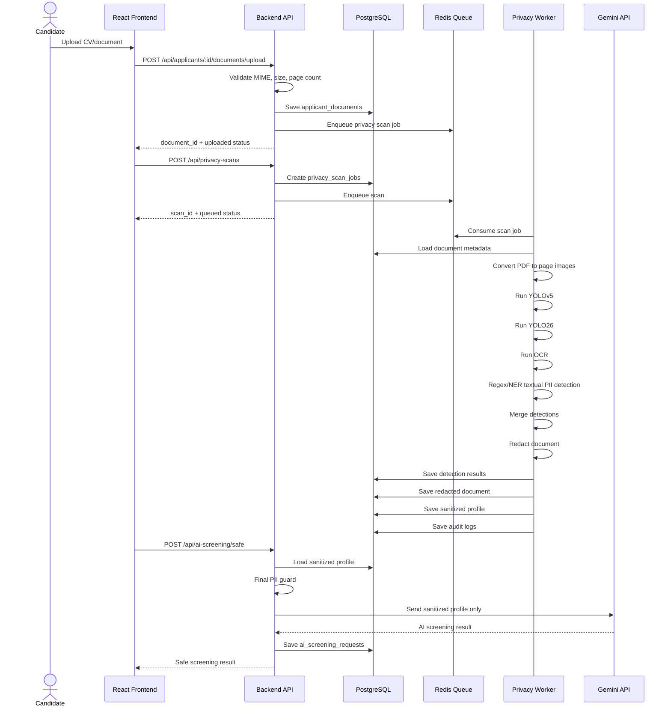
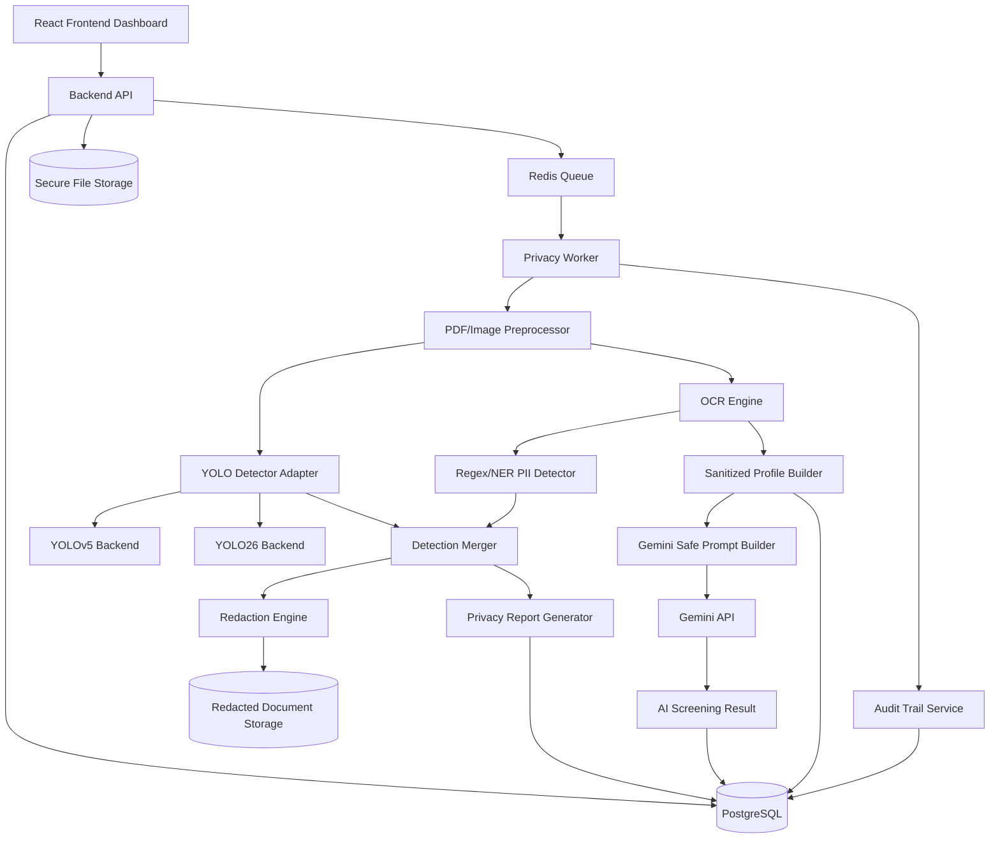

# Software Requirement Specification dan Arsitektur

## 1. Functional Requirements

| ID | Requirement | MVP |
|---|---|---|
| FR-01 | Kandidat mengunggah CV/dokumen pendukung | Ya |
| FR-02 | Sistem memvalidasi tipe file, ukuran, dan jumlah halaman | Ya |
| FR-03 | PDF dikonversi menjadi gambar per halaman | Ya |
| FR-04 | YOLOv5 mendeteksi area visual sensitif | Ya |
| FR-05 | YOLO26 mendeteksi area visual sensitif | Ya, jika tersedia |
| FR-06 | OCR membaca teks dokumen | Ya |
| FR-07 | Regex/NER mendeteksi data sensitif berbasis teks | Ya |
| FR-08 | Sistem menggabungkan hasil deteksi visual dan tekstual | Ya |
| FR-09 | Sistem melakukan redaksi area sensitif | Ya |
| FR-10 | Sistem menghasilkan sanitized document | Ya |
| FR-11 | Sistem menghasilkan sanitized candidate profile | Ya |
| FR-12 | Gemini hanya menerima sanitized candidate profile | Ya |
| FR-13 | Sistem menghasilkan Privacy Risk Report | Ya |
| FR-14 | Sistem menyimpan audit trail | Ya |
| FR-15 | Recruiter melihat hasil AI Screening tanpa data sensitif tidak perlu | Ya |
| FR-16 | Admin melihat status redaksi dan log perlindungan data | Ya |
| FR-17 | File asli disimpan aman dan tidak digunakan langsung oleh Gemini | Ya |

## 2. Non-Functional Requirements

| ID | Requirement | Target Prototype |
|---|---|---|
| NFR-01 | Proses redaksi berjalan sebagai background job | Redis worker |
| NFR-02 | Mendukung multi-page PDF | Minimal 10 halaman per dokumen |
| NFR-03 | Tidak ada PII mentah di log | Logging policy + redaction |
| NFR-04 | Audit trail tersedia | PostgreSQL audit table |
| NFR-05 | Evaluasi kuantitatif | Report CSV/JSON |
| NFR-06 | Dapat dijalankan lokal | Docker Compose opsional |
| NFR-07 | Mudah diintegrasikan dengan Echo, ReactJS, PostgreSQL, Redis, Gemini | REST API dan worker boundary jelas |

## 3. Use Case Diagram Teks

```text
Candidate
  -> Upload applicant document

Upload Protection Layer
  -> Validate file type
  -> Validate file size
  -> Validate page count
  -> Store original securely
  -> Create privacy scan job

Privacy Worker
  -> Convert PDF to page images
  -> Run YOLOv5 detector
  -> Run YOLO26 detector
  -> Run OCR
  -> Detect textual PII
  -> Merge detections
  -> Redact sensitive regions
  -> Build sanitized profile
  -> Generate reports
  -> Write audit trail

Recruiter
  -> View AI screening result
  -> View redaction summary
  -> Access sanitized candidate profile

Admin
  -> View scan status
  -> View privacy report
  -> View audit logs
  -> Compare model metrics

AI Screening Service
  -> Send sanitized profile to Gemini
  -> Store AI screening result
```

## 4. Sequence Diagram



## 5. System Architecture



## 6. Module Design

### Upload Protection Layer

Input: multipart file upload.  
Output: `applicant_document_id`.

Tanggung jawab:

1. Validasi MIME: PDF, JPG, PNG.
2. Validasi ukuran file.
3. Validasi jumlah halaman PDF.
4. Generate SHA-256 hash.
5. Simpan file asli di storage aman.
6. Buat audit log upload.

### PDF/Image Preprocessor

Input: original document.  
Output: normalized page images.

Tanggung jawab:

1. Konversi PDF ke image per halaman.
2. Menjaga urutan halaman.
3. Normalisasi DPI dan ukuran.
4. Strip metadata untuk artefak yang diproses.
5. Simpan page image sementara untuk worker.

### YOLO Sensitive Visual Detector

Input: page images.  
Output: visual detections.

Tanggung jawab:

1. Menyediakan adapter seragam untuk YOLOv5 dan YOLO26.
2. Menghasilkan bbox dalam format `[x_min, y_min, x_max, y_max]`.
3. Menyimpan confidence, class, model name, page number, latency.
4. Mendukung evaluasi model dengan dataset dan split sama.
5. Pada dataset saat ini, hanya mengeluarkan `face_photo`, `signature`, `qr_code`, `barcode`, dan `id_card`. PII visual lain diteruskan ke OCR/regex/manual review, bukan diprediksi dengan class YOLO yang tidak dilatih.

Interface:

```json
{
  "model_name": "yolov5",
  "page_number": 1,
  "class_name": "signature",
  "bbox": [120, 440, 310, 500],
  "confidence": 0.91,
  "latency_ms": 42
}
```

### OCR & Textual PII Detector

Input: page images.  
Output: text entities and coordinates.

Tanggung jawab:

1. OCR semua halaman.
2. Simpan koordinat kata/baris.
3. Jalankan regex untuk email, telepon, NIK, NPWP, tanggal, rekening.
4. Jalankan NER untuk nama, alamat, agama, status pernikahan, data keluarga jika tersedia.
5. Tandai severity dan redaction requirement.

### Redaction Engine

Input: merged detections.  
Output: sanitized document.

Tanggung jawab:

1. Menggabungkan area overlap.
2. Menerapkan black-box redaction atau blur sesuai policy.
3. Flatten hasil PDF agar teks sensitif tidak tersisa di layer selectable text.
4. Simpan redaction summary.

### Sanitized Profile Builder

Input: OCR text, redaction policy, detected PII.  
Output: sanitized candidate profile.

Field yang boleh dipertahankan:

1. Skills.
2. Work experience.
3. Education.
4. Certifications.
5. Projects.
6. Languages.
7. Professional summary.

Field yang harus dihapus:

1. Email.
2. Phone.
3. Full address.
4. NIK/NPWP.
5. Birth date.
6. Marital status.
7. Religion.
8. Family data.
9. Candidate name jika blind screening aktif.

### Gemini Safe Prompt Builder

Input: sanitized profile.  
Output: Gemini request payload.

Tanggung jawab:

1. Tidak pernah membaca file original.
2. Final PII guard sebelum request.
3. Prompt hanya memuat job description dan sanitized profile.
4. Simpan `prompt_hash`, bukan prompt mentah berisi data kandidat.

### Privacy Report Generator

Output:

1. Privacy Risk Report.
2. Redaction Report.
3. Model Comparison Summary.

### Audit Trail Service

Tanggung jawab:

1. Mencatat upload, scan started, detection completed, redaction completed, profile built, safe screening requested.
2. Tidak mencatat PII mentah.
3. Metadata hanya berupa count, class, severity, status, dan hash.

### Backend API

Tanggung jawab:

1. Endpoint upload.
2. Endpoint start scan.
3. Endpoint scan status.
4. Endpoint report.
5. Endpoint safe AI screening.
6. Endpoint sanitized profile.

### Frontend Dashboard

Tampilan MVP:

1. Upload document.
2. Scan status.
3. Risk summary.
4. Redaction summary.
5. Sanitized profile viewer.
6. Safe AI Screening result.
7. Model comparison summary.
