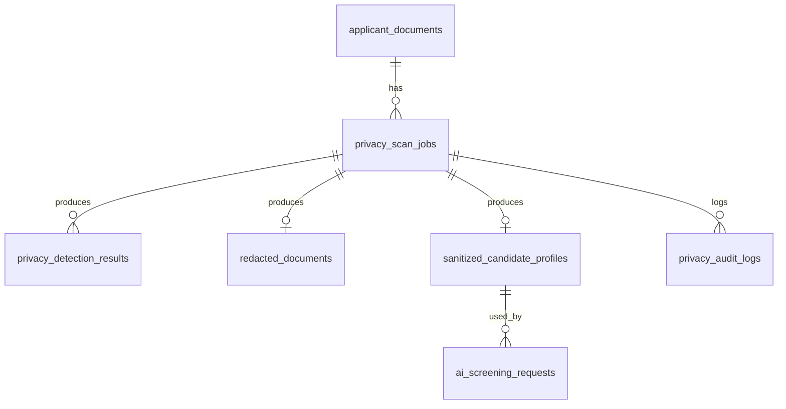

# Database Design

Database: PostgreSQL.

## Entity Relationship Ringkas



## Tabel: applicant_documents

```sql
CREATE TABLE applicant_documents (
    id UUID PRIMARY KEY,
    applicant_id UUID NOT NULL,
    document_type TEXT NOT NULL,
    original_filename TEXT NOT NULL,
    mime_type TEXT NOT NULL,
    file_size_bytes BIGINT NOT NULL,
    page_count INT,
    storage_path TEXT NOT NULL,
    sha256_hash TEXT NOT NULL,
    status TEXT NOT NULL,
    created_at TIMESTAMPTZ NOT NULL DEFAULT NOW(),
    updated_at TIMESTAMPTZ NOT NULL DEFAULT NOW()
);
```

Status:

1. `uploaded`
2. `validated`
3. `scan_queued`
4. `scan_completed`
5. `failed`

## Tabel: privacy_scan_jobs

```sql
CREATE TABLE privacy_scan_jobs (
    id UUID PRIMARY KEY,
    applicant_document_id UUID NOT NULL REFERENCES applicant_documents(id),
    status TEXT NOT NULL,
    selected_models JSONB NOT NULL,
    redaction_policy TEXT NOT NULL,
    blind_screening BOOLEAN NOT NULL DEFAULT FALSE,
    progress INT NOT NULL DEFAULT 0,
    started_at TIMESTAMPTZ,
    finished_at TIMESTAMPTZ,
    error_message TEXT,
    created_at TIMESTAMPTZ NOT NULL DEFAULT NOW()
);
```

Status:

1. `queued`
2. `running`
3. `completed`
4. `failed`

## Tabel: privacy_detection_results

```sql
CREATE TABLE privacy_detection_results (
    id UUID PRIMARY KEY,
    privacy_scan_job_id UUID NOT NULL REFERENCES privacy_scan_jobs(id),
    detector_type TEXT NOT NULL,
    detector_name TEXT NOT NULL,
    class_name TEXT NOT NULL,
    page_number INT NOT NULL,
    bbox JSONB,
    text_span JSONB,
    confidence NUMERIC(5, 4),
    severity TEXT NOT NULL,
    redaction_required BOOLEAN NOT NULL DEFAULT TRUE,
    created_at TIMESTAMPTZ NOT NULL DEFAULT NOW()
);
```

Contoh `bbox`:

```json
{
  "x_min": 120,
  "y_min": 440,
  "x_max": 310,
  "y_max": 500
}
```

Contoh `text_span`:

```json
{
  "start": 120,
  "end": 145,
  "masked_value": "[EMAIL]",
  "ocr_line_id": "line-8"
}
```

## Tabel: redacted_documents

```sql
CREATE TABLE redacted_documents (
    id UUID PRIMARY KEY,
    applicant_document_id UUID NOT NULL REFERENCES applicant_documents(id),
    privacy_scan_job_id UUID NOT NULL REFERENCES privacy_scan_jobs(id),
    storage_path TEXT NOT NULL,
    redaction_method TEXT NOT NULL,
    redaction_summary JSONB NOT NULL,
    created_at TIMESTAMPTZ NOT NULL DEFAULT NOW()
);
```

## Tabel: sanitized_candidate_profiles

```sql
CREATE TABLE sanitized_candidate_profiles (
    id UUID PRIMARY KEY,
    applicant_id UUID NOT NULL,
    privacy_scan_job_id UUID NOT NULL REFERENCES privacy_scan_jobs(id),
    profile_json JSONB NOT NULL,
    removed_fields JSONB NOT NULL,
    risk_level TEXT NOT NULL,
    created_at TIMESTAMPTZ NOT NULL DEFAULT NOW(),
    updated_at TIMESTAMPTZ NOT NULL DEFAULT NOW()
);
```

## Tabel: ai_screening_requests

```sql
CREATE TABLE ai_screening_requests (
    id UUID PRIMARY KEY,
    applicant_id UUID NOT NULL,
    job_id UUID NOT NULL,
    sanitized_candidate_profile_id UUID NOT NULL REFERENCES sanitized_candidate_profiles(id),
    provider TEXT NOT NULL,
    prompt_hash TEXT NOT NULL,
    request_status TEXT NOT NULL,
    response_json JSONB,
    privacy_status JSONB NOT NULL,
    created_at TIMESTAMPTZ NOT NULL DEFAULT NOW(),
    completed_at TIMESTAMPTZ
);
```

## Tabel: privacy_audit_logs

```sql
CREATE TABLE privacy_audit_logs (
    id UUID PRIMARY KEY,
    actor_type TEXT NOT NULL,
    actor_id UUID,
    action TEXT NOT NULL,
    entity_type TEXT NOT NULL,
    entity_id UUID NOT NULL,
    metadata JSONB NOT NULL,
    created_at TIMESTAMPTZ NOT NULL DEFAULT NOW()
);
```

## Index yang Disarankan

```sql
CREATE INDEX idx_applicant_documents_applicant_id
ON applicant_documents(applicant_id);

CREATE INDEX idx_privacy_scan_jobs_document_id
ON privacy_scan_jobs(applicant_document_id);

CREATE INDEX idx_detection_results_scan_id
ON privacy_detection_results(privacy_scan_job_id);

CREATE INDEX idx_sanitized_profiles_applicant_id
ON sanitized_candidate_profiles(applicant_id);

CREATE INDEX idx_ai_screening_requests_applicant_id
ON ai_screening_requests(applicant_id);

CREATE INDEX idx_audit_logs_entity
ON privacy_audit_logs(entity_type, entity_id);
```

## Logging Policy

Kolom `metadata` di `privacy_audit_logs` tidak boleh menyimpan:

1. Isi CV mentah.
2. Email asli.
3. Nomor telepon asli.
4. Alamat lengkap.
5. NIK/NPWP.
6. Prompt Gemini mentah.

Yang boleh disimpan:

1. Count deteksi.
2. Nama kelas deteksi.
3. Severity.
4. Status.
5. Hash.
6. Durasi proses.

